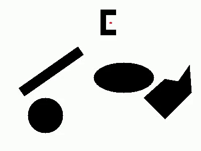

1) The file named BFS_point.py is the main code and will ask for the starting point and the goal point when program begins.
2) After the goal is found a message will be displayed in the terminal that goal has been reached and then the program
will start working on diplaying and saving the explored nodes which will take a few more minutes.
3) The path will be displayed after the visualization of the exploration is completed.
4) Please note each time the code is run a video file is created which will replace the previous one if the name is not changed 
in the code.
5) The visualization is turned on and the video of visualization is saved. The video file is created each time the video is run.
To turn off the live visualization uncomment line 315 and 326. 
6) The x coordinate range is from 0 to 399 and the y coordinate range is from 0 to 299.
7) If the video doesn't play in microsoft's default media player please use VLC media player.
8) For the start coordinates (220,254) and the goal coordinates as (180,254) the time required to reach the goal is about 25 seconds.
To complete the visualization it took about 6 minutes.

Please note:
1)If start node is given (0,0) and goal node is (399,299) the code takes upto 2.5 hours to reach the goal node and further the
live visualization takes more time.
2) Only the path from the start point to the goal point is highlighted and the goal node is not highlighted.

This code is tested on a machine with 32gb ram.

Result:

